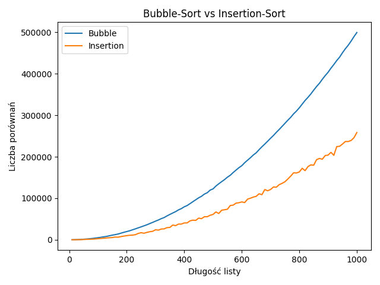
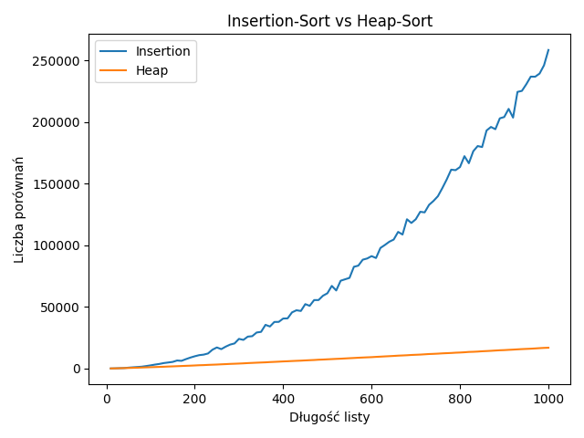
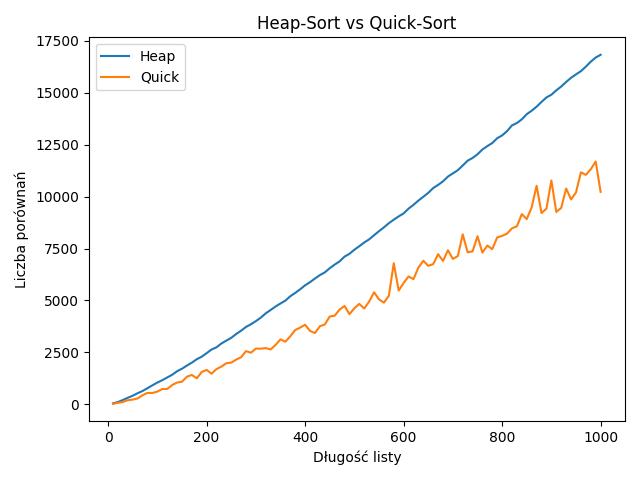

# Algorithms Lab Collection

A collection of fundamental algorithms and data structures implemented in Python. This repository contains academic projects focusing on expression parsing, empirical performance analysis of sorting algorithms, and efficient data merging.

## Table of Contents
- [Project 1: Reverse Polish Notation (RPN) Evaluator](#project-1-reverse-polish-notation-rpn-evaluator)
- [Project 2: Sorting Algorithms Performance Analysis](#project-2-sorting-algorithms-performance-analysis)
- [Project 3: K-Way Multi-Merge using Min-Heap](#project-3-k-way-multi-merge-using-min-heap)
- [Requirements & Setup](#requirements--setup)

---

## Project 1: Reverse Polish Notation (RPN) Evaluator
**File:** `onp.py`

### Overview
This project parses and evaluates mathematical expressions using Reverse Polish Notation (RPN). 
- **Infix to Postfix (`to_onp`):** Converts standard infix mathematical expressions (handling parentheses, addition `+`, and multiplication `*`) into RPN using the Shunting-yard-style stack approach.
- **Evaluation (`eval_onp`):** Evaluates the resulting RPN expression. Note: The mathematical operations are computed modulo 10.

### Usage
Run the script to start an interactive console where you can input expressions:
```bash
python onp.py
```
Type `quit` to exit the prompt.

---

## Project 2: Sorting Algorithms Performance Analysis
**Files:** `sorting.py`, `main.py`

### Overview
This project provides an empirical time-complexity analysis of various sorting algorithms by tracking the exact number of element **comparisons** they make relative to the input size.

Implemented algorithms (`sorting.py`):
- **Quick Sort**
- **Heap Sort**
- **Insertion Sort**
- **Bubble Sort**

### Data Generation & Visualization
The `main.py` script generates lists of random floats with lengths ranging from 10 to 1000. It sorts copies of these lists using all four algorithms, logs the comparison counts into `porownania.csv`, and uses `matplotlib` to plot the results.

### Performance Graphs
*The following visualizations are generated and saved in the `graphs/` directory.*

#### Overall Comparison


#### Pairwise Comparisons
- **Bubble Sort vs Insertion Sort:** 

- **Insertion Sort vs Heap Sort:** 

- **Heap Sort vs Quick Sort:** 

---

## Project 3: K-Way Multi-Merge using Min-Heap
**File:** `k_merge.py`

### Overview
This script demonstrates an optimal multi-way merge algorithm. It takes multiple separate, individually sorted arrays and merges them into a single sorted array.

### How it Works
Instead of simply concatenating the lists and running a standard sort, it leverages a **Min-Heap**:
1. It builds a Min-Heap containing the arrays.
2. It continually extracts the smallest available element.
3. It pops that element into the final merged list.
4. It calls `minHeapify` to restore the heap property, maintaining optimal time complexity per extraction.

---

## Requirements & Setup
To run the projects locally, specifically the sorting performance analysis (Project 2), you need to install the required external dependencies for data manipulation and plotting.

```bash
pip install pandas matplotlib
```
